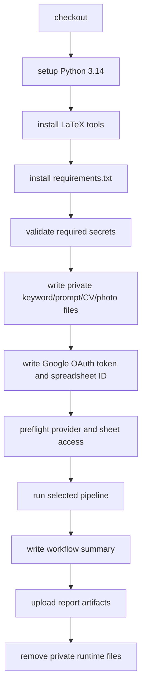

# GitHub Workflows

This directory contains the repository's CI workflow and production JobFinder
pipeline workflow. Forks use these files to test changes and to run scheduled
job searches without keeping a local machine online.

## Prerequisites

- GitHub Actions enabled for the repository.
- Repository secrets configured before running `jobs.yml`.
- Python 3.14 compatibility for code and tests.

## Quick Start

For CI, open a pull request or push to `main`; `.github/workflows/ci.yml` runs
automatically.

For the production job search:

1. Add the secrets listed in [Required Secrets](#required-secrets).
2. Open **Actions -> JobFinder Pipeline -> Run workflow**.
3. Choose sources, posted-time window, applicant cap, run mode, and row policy.
4. Read the created Google Sheet tab and the `jobfinder-run-reports` artifact.

## Use This For Your Own Project

When forking, review these workflow-specific settings:

| Setting | Where |
|---|---|
| Schedule | `jobs.yml` `on.schedule` cron entries. |
| Search defaults | `jobs.yml` `workflow_dispatch.inputs` and job `env`. |
| Germany-specific provider defaults | `INDEED_COUNTRY`, `INDEED_LOCATION`, `STEPSTONE_LOCATION`, `XING_LOCATION`, and `configs/filters.json`. |
| Generated CV filename applicant name | `JOB_EVAL_CV_PDF_APPLICANT_NAME` in `jobs.yml`. |
| Required secrets | `Validate required secrets` step and this README. |
| CI quality gates | `ci.yml` steps. |

Keep private values in repository secrets. Do not commit generated private files
that the workflow writes at runtime.

## `ci.yml`

Runs on:

- Pull requests.
- Pushes to `main`.

Checks:

1. Checkout.
2. Set up Python 3.14 with pip cache.
3. Install LaTeX tools for PDF-generation coverage.
4. Install `requirements-dev.txt`.
5. Run Ruff lint.
6. Run Ruff formatting check.
7. Run mypy on `src`.
8. Compile Python files.
9. Smoke-test CLI help with `PYTHONPATH=src`.
10. Validate `configs/filters.json`.
11. Run `pytest`.

This workflow does not require Apify, Google, or OpenAI secrets. Tests use fakes
and monkeypatching for external services.

## `jobs.yml`

Runs JobFinder in GitHub Actions.

Triggers:

- Manual `workflow_dispatch`.
- Scheduled runs at `17 7 * * *`, `37 11 * * *`, and `17 15 * * *`,
  with fallback runs guarded by `daily-run-gate`.

Manual inputs:

| Input | Options |
|---|---|
| `sources` | `linkedin`, `indeed`, `stepstone`, `xing`, `all` |
| `posted_time_window` | `since_previous_run`, `last_24h`, `last_7d`, `backfill` |
| `max_applicants` | `50`, `100`, `200`, `no_limit` |
| `run_mode` | `scrape_and_evaluate`, `scrape_only` |
| `unsuitable_rows` | `single_label_only`, `keep_all` |

## Production Job Flow

The workflow sets `JOBFINDER_SCRAPER_OUTPUT_MODE=google_sheets` and writes private
runtime files from secrets. Cleanup removes those files in an `always()` step.

## Required Secrets

| Secret | Required when | Description |
|---|---|---|
| `APIFY_API_TOKEN` | Always | One Apify token or up to 12 semicolon-separated tokens. |
| `GOOGLE_SPREADSHEET_ID` | Always | Target spreadsheet ID. |
| `GOOGLE_TOKEN_JSON` | Always | Full authorized-user token JSON from `google_token.json` for Sheets and Drive. |
| `JOB_EVAL_CV_DRIVE_FOLDER_ID` | `scrape_and_evaluate` | Drive folder ID for generated CV PDF run folders. |
| `JOB_KEYWORDS_TEXT` | Always | Contents of private `configs/keywords.txt`. |
| `OPENAI_API_KEY` | `scrape_and_evaluate` | OpenAI API key. |
| `MASTER_PROMPT_TEXT` | `scrape_and_evaluate` | Contents of private evaluator prompt. |
| `MASTER_CV_TEX` | `scrape_and_evaluate` | Contents of private LaTeX CV. |
| `CV_PHOTO_BASE64` | Optional | Base64-encoded private CV photo for LaTeX PDF generation. |

## Report Artifacts

`jobs.yml` uploads `jobfinder-run-reports` with:

- `reports/pipeline_preflight.json`
- `reports/scraper.json`
- `reports/evaluator.json`
- `reports/workflow_summary.md`

Reports are generated only when the corresponding env var path is configured.

## Operational Constraints

- `concurrency.cancel-in-progress` is `false`, so scheduled/manual runs do not
  cancel an already running pipeline.
- Scheduled runs have same-day fallback cron entries. `daily-run-gate` skips
  fallback runs after one scheduled run has already succeeded for the current
  `Europe/Berlin` day.
- The job timeout is 360 minutes.
- Scheduled runs use default workflow inputs, not the last manual selections.
- The workflow writes Google OAuth token JSON to a temporary runner file and
  applies restrictive file permissions before use.
- Do not echo secret values while debugging.

## Troubleshooting

| Problem | What to check |
|---|---|
| CI cannot import `jobfinder` | Confirm `PYTHONPATH=src` is still present in smoke tests, or install the package before running module commands. |
| Production workflow fails before scraping | Check the `Validate required secrets` step for the exact missing secret. |
| Scheduled run did not create a tab | Check whether `daily-run-gate` skipped it because a scheduled run already succeeded that Berlin day. |
| Workflow uses the wrong geography or applicant name | Update `jobs.yml` env values and `configs/filters.json` in the fork. |
| Report artifact is missing | Confirm `JOBFINDER_*_REPORT_FILE` env vars still point under `reports/` and the upload step has not been removed. |
