# JobFinder

JobFinder is a Python automation platform for running a repeatable job-search
workflow. It scrapes job postings from Apify-backed LinkedIn, Indeed, Stepstone,
and Xing actors, normalizes provider-specific output, deduplicates jobs across
keywords and providers, filters unwanted rows, exports to Excel or Google
Sheets, and optionally evaluates each job with OpenAI against a private prompt
and private LaTeX CV.

The project is intentionally operational: it can run locally for development and
debugging, or on GitHub Actions for scheduled production runs that write directly
to Google Sheets.

## Executive Overview

JobFinder exists to reduce repeated manual job-search work while keeping the
candidate's private search inputs, CV, and evaluator prompt outside Git.

The core workflow is:

1. Load private keywords from `configs/keywords.txt`.
2. Load non-secret filters and provider defaults from `configs/filters.json`.
3. Resolve runtime settings from environment variables and `.env`.
4. Build provider searches for LinkedIn, Indeed, Stepstone, Xing, or a selected mix.
5. Run Apify actors with retries, bounded concurrency, and optional token
   fallback.
6. Normalize provider output into a stable spreadsheet contract.
7. Deduplicate rows across keywords, providers, and historical Google Sheet
   runs.
8. Apply title, company, applicant-count, and posted-window filters.
9. Export a timestamped worksheet to Excel, Google Sheets, or both.
10. Optionally evaluate unevaluated rows with OpenAI, compile suitable tailored
    LaTeX CVs into PDFs, upload them to Google Drive, and write final AI columns
    back to the same sheet.
11. Remove job-description/detail columns and, by default, remove `Not Suitable`
    rows that have more than one unsuitable-reason label.

Key capabilities:

- Multi-provider scraping through Apify actors.
- Deterministic cross-provider deduplication without AI.
- Historical duplicate suppression through Google Sheets run history.
- Scheduled and manual GitHub Actions pipeline runs.
- OAuth-only Google Sheets and Drive integration using the user's account.
- OpenAI-based job-fit evaluation with prompt and CV injection.
- LaTeX PDF generation for tailored CVs, with Google Drive links in the sheet.
- Incremental evaluator saves for crash recovery.
- Runtime reports for CI artifacts.
- Excel output for local-only runs.

## Architecture

```mermaid
flowchart LR
    A["configs/keywords.txt<br/>configs/filters.json<br/>.env / secrets"] --> B["ScraperSettings"]
    B --> C["Search builder<br/>src/jobfinder/scraper/search.py"]
    C --> D["Apify actors<br/>LinkedIn / Indeed / Stepstone / Xing"]
    D --> E["Provider normalizers"]
    E --> F["Dedupe pipeline<br/>src/jobfinder/dedupe"]
    F --> G["Final filters<br/>title / company / applicants / posted window"]
    G --> H["Exports<br/>Excel or Google Sheets"]
    H --> I["Evaluator queue<br/>unevaluated rows only"]
    I --> J["OpenAI Responses API"]
    J --> K["Incremental writes<br/>final cleanup"]
```



### Runtime Boundaries

| Boundary | Main modules | Responsibility |
|---|---|---|
| Configuration | `env.py`, `config_files.py`, `scraper/settings.py` | Merge real env, `.env`, `filters.json`, and `keywords.txt` into typed runtime settings. |
| Provider adapters | `providers/` | Build actor payloads, normalize source-specific actor output, and register provider adapters. |
| Scraper orchestration | `scraper/search.py`, `scraper/service.py` | Build searches, run Apify concurrently, handle retries, and produce raw job groups. |
| Dedupe | `dedupe/` | Convert raw jobs into normalized features, match duplicate clusters, and merge canonical jobs. |
| Export | `scraper/export_excel.py`, `scraper/export_google_sheets.py` | Write stable spreadsheet rows and formatting. |
| Run history | `scraper/run_history.py` | Read prior Google Sheet tabs, derive previous-run windows, and maintain hidden seen-job keys. |
| Evaluation | `evaluator/` | Read rows, build prompts, call OpenAI, parse responses, save results, and clean final output. |
| Pipeline | `pipeline/` | Run scraper then evaluator in one command and provide preflight checks. |
| Operations | `operations/reports.py` | Write sanitized JSON reports for GitHub Actions artifacts. |

## Execution Flow

### Provider Flow

Provider selection is controlled by `JOBFINDER_SCRAPER_SOURCES`.

Supported values:

| Value | Sources |
|---|---|
| `linkedin` | LinkedIn only |
| `indeed` | Indeed only |
| `stepstone` | Stepstone only |
| `xing` | Xing only |
| `all` | LinkedIn, Indeed, Stepstone, and Xing |
| `linkedin,stepstone,xing` | Explicit comma-separated source list |

Current Apify actors:

| Source | Actor ID | Adapter behavior |
|---|---|---|
| LinkedIn | `curious_coder~linkedin-jobs-scraper` | Builds LinkedIn search URLs from keyword, location, geo ID, experience level, job type, and posted-time window. Optional LinkedIn batching is supported only when result attribution is safe. |
| Indeed | `valig~indeed-jobs-scraper` | Builds actor payloads with country, title, location, result limit, and supported day-bucket date filters. Normalizes employer, salary, benefit, skill, education, seniority, and remote metadata. |
| Stepstone | `memo23~stepstone-search-cheerio-ppr` | Builds keyword/location/category payloads or a single direct-URL payload. Normalizes relative URLs, salary, work mode, labels, skills, category, and company metadata. |
| Xing | `shahidirfan~Xing-Jobs-Scraper` | Builds keyword/location/discipline payloads or a single direct search URL payload. Normalizes Xing IDs, company details, salary, work mode, keywords, application links, and description metadata. |

`src/jobfinder/providers` contains the stable provider adapter surface for new
code, including the provider registry and low-level Apify client.
`src/jobfinder/scraper/providers` keeps compatibility imports for older local
code.

### Scraping Flow

1. `load_scraper_settings()` reads `configs/filters.json`,
   `configs/keywords.txt`, `.env`, and real environment variables.
2. If Google Sheets output is enabled, the scraper authenticates first and reads
   spreadsheet history.
3. `JOBFINDER_SCRAPER_POSTED_TIME_WINDOW` is applied:
   - `since_previous_run` uses the newest timestamped prior Google Sheet tab,
     plus `JOBFINDER_SCRAPER_SEARCH_WINDOW_BUFFER_SECONDS`, as a broad provider search
     window.
   - `last_24h` and `last_7d` force fixed provider windows.
   - `backfill` removes the provider posted-time filter.
4. `search.py` builds one `SearchRequest` per provider/keyword, except
   Stepstone and Xing direct URL modes, which create one configured-URL run.
5. Searches run through Apify with global and source-specific concurrency
   limits.
6. Temporary Apify failures are retried. Exhausted or unauthorized Apify tokens
   can be retired for the current process when multiple tokens are configured.
7. Provider output is annotated with `_source` and `_source_label`, then passed
   into dedupe.

Stepstone and Xing search failures are isolated by source so other providers can
still complete. LinkedIn and Indeed search execution failures are treated as
fatal because they usually indicate the selected main source did not complete.

### Dedupe Flow

The production dedupe path is `jobfinder.dedupe.matching.deduplicate_search_results`.
It is deterministic and does not call OpenAI.

The matcher uses:

- Normalized company, title, location, job type, and posted time.
- External company apply URL as a strong cross-provider signal.
- Source-aware blocking keys to avoid full pairwise comparison.
- Explicit blockers for conflicting seniority, role family, job type, and old
  posted-time distance.

The matcher deliberately does not use provider job URLs as a cross-provider
identity signal. Provider URLs are useful for provenance, but the same real-world
job often has different board-specific IDs across LinkedIn, Indeed, Stepstone,
and Xing.

Merged jobs preserve:

- Combined `App` label, such as `LinkedIn | Indeed`.
- All matched keywords in first-seen order.
- Richest description and metadata available across duplicate rows.
- `_jobfinder_provenance` for source-specific URLs, IDs, and keywords.
- Internal salary and provider metadata for future filtering or debugging.

### Historical Tracking Flow

When Google Sheets output is enabled, `scraper/run_history.py` reads the existing
spreadsheet before scraping:

- The newest parseable `Posted` value across existing tabs determines the
  `since_previous_run` lower bound; timestamped tab names are only a fallback.
- `_jobfinder_seen_jobs` is a hidden tab containing canonical historical job
  keys.
- If the hidden index does not exist, the scraper scans previous spreadsheet
  tabs and seeds it during a real export.
- Preflight validates access without seeding the hidden index.

Historical duplicate keys are built from spreadsheet identity fields such as
source, title, company, location, job type, posted date, and external apply URL.

### Evaluation Flow

The evaluator can read from Excel or Google Sheets. If no source is specified,
it chooses Google Sheets when a spreadsheet ID is configured; otherwise it uses
Excel.

1. Read the selected sheet, with `latest` resolving to the newest worksheet/tab.
2. Ensure the evaluator AI columns exist:
   - `AI Verdict`
   - `AI Fit Score`
   - `AI Unsuitable Reasons`
   - `AI Tailored CV`
   - `AI CV PDF`
3. Skip rows with an existing non-`Error` `AI Verdict`.
4. Build each job advertisement from useful row columns, excluding URLs,
   applicant/status fields, and existing AI output.
5. Compose the model input from `prompts/master_prompt.txt`, the row
   advertisement, and `cv/master_cv.tex`.
6. Call the OpenAI Responses API with strict machine-readable output
   instructions.
7. Parse `Verdict:`, `Fit Score:`, `Unsuitable Reasons:`, and optional tailored
   LaTeX CV content.
8. Save each completed evaluation immediately, or in batches controlled by
   `JOB_EVAL_SAVE_BATCH_SIZE`.
9. Compile generated CV LaTeX into PDFs, upload them to a timestamped Google
   Drive run folder under `JOB_EVAL_CV_DRIVE_FOLDER_ID`, and write the PDF link
   or compilation error to `AI CV PDF`.
10. Finalize by removing legacy AI metadata columns, detail columns such as
   `Job Description`, and the temporary `AI Tailored CV` column when PDF output
   is enabled.
11. Apply `JOB_EVAL_UNSUITABLE_ROW_POLICY`.

Default evaluator policy:

| Policy | Behavior |
|---|---|
| `single_label_only` | Keep suitable rows and keep only `Not Suitable` rows with exactly one unsuitable-reason label. Remove other rejected rows. |
| `keep_all` | Preserve every evaluated row. |

## Installation

### Requirements

- Python 3.14 or newer.
- LaTeX tooling for evaluator PDF output: `latexmk` and `xelatex`.
- Apify API token for scraping.
- OpenAI API key for `scrape_and_evaluate` or evaluator-only runs.
- Google OAuth Desktop client credentials and a one-time browser authorization
  for the account that should own Sheets and uploaded PDFs.
- Optional local Excel workflow through `openpyxl`.

Install runtime dependencies with Conda:

```bash
conda create -n JobFinder python=3.14 -y
conda activate JobFinder
python -m pip install -r requirements.txt
```

Install development dependencies:

```bash
python -m pip install -r requirements-dev.txt
```

Install LaTeX tools for CV PDF generation. On Ubuntu/GitHub Actions this is:

```bash
sudo apt-get install -y latexmk texlive-xetex texlive-latex-extra
```

On macOS, install a TeX distribution that includes `latexmk` and `xelatex`, such
as MacTeX.

Install the package in editable mode when you want console scripts:

```bash
python -m pip install -e .
```

Editable install exposes:

```bash
jobfinder-pipeline
jobfinder-scrape
jobfinder-evaluate
```

Without editable install, use the root compatibility scripts:

```bash
python run_job_pipeline.py --help
python linkedin_job_scraper.py --help
python job_fit_evaluator.py --help
```

For direct module execution without editable install, set `PYTHONPATH=src`:

```bash
env PYTHONPATH=src python -m jobfinder.pipeline.cli --help
```

## Private Setup

Create local private files from examples:

```bash
cp .env.example .env
cp configs/keywords.example.txt configs/keywords.txt
cp prompts/master_prompt.example.txt prompts/master_prompt.txt
cp cv/master_cv.example.tex cv/master_cv.tex
```

Edit:

| File | Purpose | Commit? |
|---|---|---|
| `.env` | Local secrets and runtime settings. | No |
| `configs/keywords.txt` | One search keyword per line. Blank lines and `#` comments are ignored. | No |
| `configs/filters.json` | Shared non-secret provider defaults and final filters. | Yes |
| `prompts/master_prompt.txt` | Private evaluator instructions. | No |
| `cv/master_cv.tex` | Private LaTeX CV used by evaluator prompts. | No |
| `cv/photo.jpg` | Optional CV photo copied into the LaTeX build directory. | Only if public |

### Apify Setup

Set one token:

```bash
APIFY_API_TOKEN=apify_api_...
```

Or configure ordered token fallback with up to 12 semicolon-separated tokens:

```bash
APIFY_API_TOKEN=apify_api_1;apify_api_2;apify_api_3
```

When Apify reports that a token cannot run or pay for an actor, JobFinder retires
that token for the current process and retries the same actor run with the next
configured token.

### OpenAI Setup

Set:

```bash
OPENAI_API_KEY=sk-...
```

The evaluator default model is defined in code as `gpt-5-mini` and can be
overridden with:

```bash
JOB_EVAL_OPENAI_MODEL=gpt-5-mini
```

### Google Sheets And Drive Setup

JobFinder uses Google OAuth for both Google Sheets and Google Drive. The same
`google_token.json` reads and writes Sheets, creates new spreadsheets in the
authorized user's Drive account, refreshes automatically, and uploads generated
PDFs to that user's Drive folder.

Set up OAuth once:

1. Enable the Google Sheets API and Google Drive API in Google Cloud.
2. Configure the OAuth consent screen and publish the app to Production. Testing
   mode refresh tokens can expire after 7 days.
3. Create an OAuth client of type Desktop app.
4. Download the client JSON locally as `google_client_secret.json`.
5. Run `python -m jobfinder.google_auth` from the repository. Your browser will
   ask for Sheets and Drive access, then JobFinder saves `google_token.json`.
6. Set `GOOGLE_SPREADSHEET_ID` or save the ID in `google_spreadsheet_id.txt`.
   If no spreadsheet ID is configured, scraper Google Sheets output creates a
   new `jobs` spreadsheet in the authorized user's Drive account.
7. Set `JOB_EVAL_CV_DRIVE_FOLDER_ID` to the Drive folder ID where timestamped
   PDF run folders should be created.
8. Verify locally with `env PYTHONPATH=src python -m jobfinder.google_auth --check`.

For GitHub Actions, paste the contents of `google_token.json` into the
`GOOGLE_TOKEN_JSON` secret and set `JOB_EVAL_CV_DRIVE_FOLDER_ID`.

## Quick Start

Run a configuration and Google Sheets preflight:

```bash
python run_job_pipeline.py --preflight
```

Scrape only to Google Sheets:

```bash
python run_job_pipeline.py --mode scrape_only
```

Run the full scrape and OpenAI evaluation pipeline:

```bash
python run_job_pipeline.py --mode scrape_and_evaluate
```

Scrape locally to Excel:

```bash
JOBFINDER_SCRAPER_OUTPUT_MODE=excel python linkedin_job_scraper.py
```

Evaluate the latest Google Sheet tab:

```bash
python job_fit_evaluator.py --source google_sheets --sheet latest
```

Evaluate the latest Excel worksheet:

```bash
python job_fit_evaluator.py --source excel --sheet latest
```

## CLI Usage

### Pipeline CLI

```bash
python run_job_pipeline.py --help
```

Supported options:

| Option | Description |
|---|---|
| `--mode scrape_only` | Scrape jobs to Google Sheets and stop. |
| `--mode scrape_and_evaluate` | Scrape jobs to Google Sheets, then evaluate the latest tab. |
| `--preflight` | Validate settings, dependencies, Google Sheets access, and evaluator inputs without running the pipeline. |

Examples:

```bash
python run_job_pipeline.py --mode scrape_only --preflight
python run_job_pipeline.py --mode scrape_only
python run_job_pipeline.py --mode scrape_and_evaluate
```

The pipeline always forces `JOBFINDER_SCRAPER_OUTPUT_MODE=google_sheets` because the
evaluator step reads the newly created Google Sheet tab.

### Scraper CLI

The scraper CLI has no CLI flags today; it is configured by environment variables
and config files.

```bash
python linkedin_job_scraper.py
```

Examples:

```bash
JOBFINDER_SCRAPER_OUTPUT_MODE=excel JOBFINDER_SCRAPER_SOURCES=linkedin python linkedin_job_scraper.py
JOBFINDER_SCRAPER_OUTPUT_MODE=both JOBFINDER_SCRAPER_SOURCES=all python linkedin_job_scraper.py
JOBFINDER_SCRAPER_OUTPUT_MODE=google_sheets JOBFINDER_SCRAPER_SOURCES=linkedin,stepstone,xing python linkedin_job_scraper.py
```

### Evaluator CLI

```bash
python job_fit_evaluator.py --help
```

Supported options:

| Option | Description |
|---|---|
| `--source` | `excel`, `xlsx`, `local`, `google`, `google_sheets`, `sheets`, or `drive`. |
| `--sheet` | Worksheet/tab name. Defaults to `JOB_EVAL_SHEET` or `latest`. |
| `--google-sheet-id` | One-off spreadsheet ID override. |

Examples:

```bash
python job_fit_evaluator.py --source google_sheets --sheet latest
python job_fit_evaluator.py --source google --google-sheet-id 1abcDEFghiJKLmnop123
python job_fit_evaluator.py --source excel --sheet latest
JOB_EVAL_UNSUITABLE_ROW_POLICY=keep_all python job_fit_evaluator.py --source google_sheets
```

## Configuration Reference

Environment variables override values from `.env`.

### Core Runtime

| Variable | Default | Description |
|---|---:|---|
| `APIFY_API_TOKEN` | blank | One Apify token, or 1 to 12 semicolon-separated tokens for fallback. |
| `OPENAI_API_KEY` | blank | Required for evaluator and full pipeline runs. |
| `GOOGLE_SPREADSHEET_ID` | blank | Google Sheet ID. Also read from `google_spreadsheet_id.txt` when absent. |
| `JOBFINDER_SCRAPER_OUTPUT_MODE` | `excel` | `excel`, `google_sheets`, or `both`. Full pipeline forces `google_sheets`. |
| `JOBFINDER_SCRAPER_SOURCES` | `linkedin` | `linkedin`, `indeed`, `stepstone`, `xing`, `all`, or comma-separated source names. |
| `JOBFINDER_PIPELINE_MODE` | `scrape_and_evaluate` | Used by the pipeline when `--mode` is omitted. |
| `JOBFINDER_SCRAPER_TIMEZONE` | `Europe/Berlin` | Timezone for logs and timestamped worksheet names. |
| `JOBFINDER_SCRAPER_POSTED_TIMEZONE` | `Europe/Berlin` | Timezone used for the `Posted` spreadsheet column and exact posted-window filtering. |

### Scraper Search And Apify

| Variable | Default | Description |
|---|---:|---|
| `JOBFINDER_SCRAPER_SEARCH_CONCURRENCY` | `15` | Global search execution units allowed in parallel. |
| `JOBFINDER_SCRAPER_APIFY_MEMORY_LIMIT_MB` | `0` | Optional total Apify memory budget that can lower effective search concurrency. `0` disables the cap. |
| `JOBFINDER_SCRAPER_APIFY_BATCH_SIZE` | `1` | Optional LinkedIn search batch size. Keep `1` unless actor output provides safe search attribution. |
| `JOBFINDER_SCRAPER_MAX_RESULTS_PER_SEARCH` | `500` | LinkedIn max results per keyword. Also used as provider fallback. |
| `JOBFINDER_SCRAPER_POSTED_TIME_WINDOW` | `since_previous_run` | `since_previous_run`, `last_24h`, `last_7d`, or `backfill`. |
| `JOBFINDER_SCRAPER_SEARCH_WINDOW_BUFFER_SECONDS` | `3600` | Extra provider search padding when using previous-run windows. |
| `JOBFINDER_SCRAPER_MAX_APPLICANTS` | value from `filters.json` | Applicant cap after scraping. `0` disables the filter. |
| `APIFY_RUN_MEMORY_MB` | `512` | Memory assigned to each Apify actor run. Minimum in code is `128`. |
| `APIFY_RUN_TIMEOUT_SECONDS` | `3600` | Actor run timeout. Minimum in code is `60`. |
| `APIFY_CLIENT_TIMEOUT_SECONDS` | `120` | HTTP timeout for Apify API calls. |
| `APIFY_TRANSIENT_ERROR_RETRIES` | `5` | Retries for temporary Apify errors. |
| `APIFY_RETRY_DELAY_SECONDS` | `30` | Base retry delay. Retries cap at 300 seconds. |
| `JOBFINDER_SCRAPER_DELAY_BETWEEN_REQUESTS` | `0` | Optional delay between starting search execution units. |
| `JOBFINDER_SCRAPER_SCRAPE_COMPANY_DETAILS` | `false` | LinkedIn actor option. |
| `JOBFINDER_SCRAPER_USE_INCOGNITO_MODE` | `true` | LinkedIn actor option. |
| `JOBFINDER_SCRAPER_SPLIT_BY_LOCATION` | `false` | LinkedIn actor option. |

### Indeed

| Variable | Default | Description |
|---|---:|---|
| `INDEED_COUNTRY` | `DE` | Country code used to choose the Indeed domain and actor country. |
| `INDEED_LOCATION` | LinkedIn location | Search location. |
| `INDEED_MAX_RESULTS_PER_SEARCH` | `500` | Per-keyword result limit, capped at `1000`. |
| `INDEED_MAX_CONCURRENCY` | `5` | Source-specific cap for simultaneous Indeed searches. |
| `INDEED_SAVE_ONLY_UNIQUE_ITEMS` | `true` | Stored in settings and logged for compatibility; the active actor payload does not include this field. |

Indeed date filtering maps `rSECONDS` windows to supported day buckets:
`1`, `3`, `7`, or `14`. Longer windows omit the actor date filter and rely on
post-scrape filtering.

### Stepstone

| Variable | Default | Description |
|---|---:|---|
| `STEPSTONE_LOCATION` | value from `filters.json` or `Germany` | Location source for keyword searches. |
| `STEPSTONE_CATEGORY` | value from `filters.json` or blank | Optional category fallback when no keyword is used. |
| `STEPSTONE_START_URLS` | blank | Comma- or newline-separated Stepstone URLs. When set, Stepstone runs one direct-URL actor search instead of one search per keyword. |
| `STEPSTONE_MAX_RESULTS_PER_SEARCH` | `500` | Max results per keyword or direct URL run. |
| `STEPSTONE_MAX_CONCURRENCY` | `10` | Source-specific search cap in JobFinder and actor concurrency payload. |
| `STEPSTONE_MIN_CONCURRENCY` | `1` | Actor `minConcurrency`. Capped to max concurrency in the payload. |
| `STEPSTONE_MAX_REQUEST_RETRIES` | `3` | Actor page retry count. |
| `STEPSTONE_USE_APIFY_PROXY` | `true` | Actor proxy setting. |
| `STEPSTONE_APIFY_PROXY_GROUPS` | `RESIDENTIAL` | Comma- or newline-separated Apify proxy groups. |

Stepstone date filtering maps `rSECONDS` windows to supported day buckets:
`1`, `3`, or `7`. Longer windows use `all`.

### Xing

| Variable | Default | Description |
|---|---:|---|
| `XING_LOCATION` | value from `filters.json` or LinkedIn location | Country, city, or region filter for keyword searches. |
| `XING_DISCIPLINE` | blank | Optional professional discipline filter. Blank means keyword-only role filtering. |
| `XING_REMOTE` | blank | Optional remote filter passed through to the actor when set. |
| `XING_START_URL` | value from `filters.json` or blank | Optional direct Xing search URL. When set, Xing runs one direct-URL actor search instead of one search per keyword. |
| `XING_MAX_RESULTS_PER_SEARCH` | `500` | Max results per keyword or direct URL run. |
| `XING_MAX_PAGES` | `20` | Maximum Xing result pages for the actor to process. |
| `XING_MAX_CONCURRENCY` | `5` | Source-specific cap for simultaneous Xing searches in JobFinder. |
| `XING_USE_APIFY_PROXY` | `true` | Actor proxy setting. |
| `XING_APIFY_PROXY_GROUPS` | `RESIDENTIAL` | Comma- or newline-separated Apify proxy groups. |

The Xing actor does not expose a posted-time input in JobFinder. Posted-window
filtering is applied after scraping when Xing returns `date_posted` values.

### Evaluator

| Variable | Default | Description |
|---|---:|---|
| `JOB_EVAL_SOURCE` | inferred | `excel` or `google_sheets`. Inferred from spreadsheet ID when blank. |
| `JOB_EVAL_SHEET` | `latest` | Worksheet/tab to evaluate. |
| `JOB_EVAL_GOOGLE_SPREADSHEET_ID` | blank | Evaluator-specific spreadsheet ID override. |
| `JOB_EVAL_EXCEL_FILE` | `jobs.xlsx` | Excel workbook path. |
| `JOB_EVAL_MASTER_PROMPT_FILE` | `prompts/master_prompt.txt` | Prompt file path. |
| `JOB_EVAL_CV_FILE` | `cv/master_cv.tex` | CV file path. |
| `JOB_EVAL_OPENAI_MODEL` | `gpt-5-mini` | OpenAI model for evaluation. |
| `JOB_EVAL_BATCH_SIZE` | `40` | Number of queued records processed per local batch. |
| `JOB_EVAL_CONCURRENCY` | `8` | OpenAI requests allowed in parallel inside each batch. |
| `JOB_EVAL_OPENAI_RETRIES` | `3` | Retries for retryable OpenAI failures. |
| `JOB_EVAL_RETRY_BASE_DELAY` | `2.0` | Base exponential retry delay. |
| `JOB_EVAL_RETRY_MAX_DELAY` | `60.0` | Maximum retry delay before jitter. |
| `JOB_EVAL_OPENAI_TIMEOUT` | `120` | OpenAI SDK request timeout in seconds. |
| `JOB_EVAL_MAX_OUTPUT_TOKENS` | `9000` | Max tokens for each model response. Must be at least `500`. |
| `JOB_EVAL_CV_PDF_OUTPUT` | `true` | Compile generated LaTeX CVs to PDFs and upload them to Google Drive. |
| `JOB_EVAL_CV_PHOTO_FILE` | `cv/photo.jpg` | Optional local photo copied into each isolated LaTeX build directory. |
| `JOB_EVAL_CV_PDF_TIMEOUT` | `120` | Max seconds allowed for one LaTeX PDF compilation. |
| `JOB_EVAL_CV_DRIVE_FOLDER_ID` | blank | Google Drive folder ID for timestamped evaluator PDF folders. Required when `JOB_EVAL_CV_PDF_OUTPUT=true`. |
| `JOB_EVAL_CV_PDF_APPLICANT_NAME` | `Applicant` | Applicant name used in upload-safe PDF filenames like `12_CV_Applicant_GIS_Analyst_Acme.pdf`. |
| `JOB_EVAL_LARGE_QUEUE_THRESHOLD` | `200` | Enables request pacing when queued rows exceed this count. |
| `JOB_EVAL_LARGE_QUEUE_SLEEP_MS` | `2000` | Delay between request starts when pacing is enabled. |
| `JOB_EVAL_SAVE_BATCH_SIZE` | `1` | Number of completed evaluations saved per write. |
| `JOB_EVAL_UNSUITABLE_ROW_POLICY` | `single_label_only` | `single_label_only` or `keep_all`. |

### Runtime Reports

These variables are used by GitHub Actions, but can also be set locally:

| Variable | Description |
|---|---|
| `JOBFINDER_PIPELINE_REPORT_FILE` | JSON preflight report path. |
| `JOBFINDER_SCRAPER_REPORT_FILE` | JSON scraper report path. |
| `JOBFINDER_EVALUATOR_REPORT_FILE` | JSON evaluator report path. |

## Config Files

### `configs/filters.json`

Current sections:

| Section | Keys | Used by |
|---|---|---|
| `linkedin_search` | `location`, `geo_id`, `published_at`, `experience_levels`, `contract_types`, `split_country` | LinkedIn URL builder and scraper settings. |
| `stepstone_search` | `location`, `category`, `start_urls` | Stepstone settings fallback when env vars are not set. |
| `xing_search` | `location`, `discipline`, `remote`, `start_url`, `max_pages` | Xing settings fallback when env vars are not set. |
| `final_filters` | `excluded_title_terms`, `excluded_company_terms`, `max_applicants` | Final in-memory filters after dedupe. |
| `spreadsheet` | `application_status_options` | Google Sheets dropdown validation. |

### `configs/keywords.txt`

The private keyword file is line based:

```text
# comments are ignored
GIS analyst
geospatial data
remote sensing
```

Each keyword is searched against each selected provider, except Stepstone and
Xing direct URL modes.

## Google Sheets Output

Scraper exports create a new timestamped tab using `JOBFINDER_SCRAPER_TIMEZONE`.

Stable scraper columns:

| Column | Description |
|---|---|
| `Application Status` | Empty cell or Google Sheets dropdown. |
| `App` | Source label, possibly combined after dedupe. |
| `Job Title` | Normalized title. |
| `Company` | Normalized company. |
| `Location` | Normalized location. |
| `Job Type` | Employment type text when available. |
| `Job Description` | Prompt/evaluation source text; removed after evaluation cleanup. |
| `Posted` | Parsed and formatted posting date/time when available. |
| `Applicants` | Applicant count text from provider output. |
| `Keywords Matched` | Keywords that returned this canonical job. |
| `Job URL` | Spreadsheet hyperlink to the posting. |
| `Apply URL` | Spreadsheet hyperlink to the external application URL when available. |
| `AI Verdict` | Filled by evaluator. |
| `AI Fit Score` | Filled by evaluator using the 0-26 job-fit scoring rubric. |
| `AI Unsuitable Reasons` | Filled for rejected rows. |
| `AI Tailored CV` | Temporary tailored LaTeX CV content; removed during final cleanup when PDF output is enabled. |
| `AI CV PDF` | Google Drive PDF link, or a compile/upload error for that row. |

The hidden `_jobfinder_seen_jobs` tab is maintained by the scraper. Do not edit
it manually unless you are deliberately resetting historical dedupe state.

## GitHub Actions

The repository has two workflow files:

| Workflow | File | Purpose |
|---|---|---|
| CI | `.github/workflows/ci.yml` | Runs on pull requests and pushes to `main`. Installs dev dependencies, runs Ruff, formatting check, mypy, compile checks, CLI smoke tests, JSON validation, and pytest. |
| JobFinder Pipeline | `.github/workflows/jobs.yml` | Manual and scheduled production pipeline. Installs runtime dependencies, writes private files from secrets, runs preflight, runs the selected pipeline, uploads reports, and removes private files. |

The production workflow supports manual inputs:

- `sources`: `linkedin`, `indeed`, `stepstone`, `xing`, or `all`.
- `posted_time_window`: `since_previous_run`, `last_24h`, `last_7d`, or
  `backfill`.
- `max_applicants`: `50`, `100`, `200`, or `no_limit`.
- `run_mode`: `scrape_and_evaluate` or `scrape_only`.
- `unsuitable_rows`: `single_label_only` or `keep_all`.

It also runs on a morning schedule with same-day fallback entries:

```yaml
schedule:
  - cron: "17 7 * * *"
  - cron: "37 11 * * *"
  - cron: "17 15 * * *"
```

Fallback runs are skipped by `daily-run-gate` after one scheduled run has
already succeeded for the current `Europe/Berlin` day.

Required GitHub secrets:

| Secret | Required for | Description |
|---|---|---|
| `APIFY_API_TOKEN` | all runs | One token or up to 12 semicolon-separated fallback tokens. |
| `OPENAI_API_KEY` | `scrape_and_evaluate` | OpenAI API key. |
| `GOOGLE_SPREADSHEET_ID` | all runs | Target spreadsheet ID. |
| `GOOGLE_TOKEN_JSON` | all runs | Full authorized-user token JSON from `google_token.json` for Sheets and Drive. |
| `JOB_EVAL_CV_DRIVE_FOLDER_ID` | `scrape_and_evaluate` | Google Drive folder ID for generated CV PDF run folders. |
| `JOB_KEYWORDS_TEXT` | all runs | Full private keyword file content. |
| `MASTER_PROMPT_TEXT` | `scrape_and_evaluate` | Full private evaluator prompt. |
| `MASTER_CV_TEX` | `scrape_and_evaluate` | Full private LaTeX CV. |
| `CV_PHOTO_BASE64` | optional | Base64-encoded private CV photo for CI. Use only if you do not commit a public `cv/photo.jpg`. |

More detailed runbooks are kept in:

- [README.local.md](README.local.md)
- [README.github-actions.md](README.github-actions.md)

## Folder Structure

```text
JobFinder/
├── .github/
│   ├── dependabot.yml
│   └── workflows/
│       ├── ci.yml
│       └── jobs.yml
├── configs/
│   ├── filters.json
│   └── keywords.example.txt
├── cv/
│   └── master_cv.example.tex
├── prompts/
│   └── master_prompt.example.txt
├── scripts/
│   ├── evaluate_jobs.py
│   ├── run_pipeline.py
│   └── scrape_jobs.py
├── src/jobfinder/
│   ├── core/
│   ├── dedupe/
│   ├── evaluator/
│   ├── operations/
│   ├── pipeline/
│   ├── providers/
│   ├── scraper/
│   │   └── providers/
│   └── spreadsheet/
├── tests/
├── job_fit_evaluator.py
├── job_scraper_config.py
├── linkedin_job_scraper.py
└── run_job_pipeline.py
```

Important documentation entry points:

| Path | Purpose |
|---|---|
| `src/jobfinder/README.md` | Package architecture and boundaries. |
| `src/jobfinder/scraper/README.md` | Scraper execution, settings, exports, and extension points. |
| `src/jobfinder/providers/README.md` | Provider adapter contracts. |
| `src/jobfinder/dedupe/README.md` | Matching and merge design. |
| `src/jobfinder/evaluator/README.md` | Evaluation pipeline and storage behavior. |
| `src/jobfinder/pipeline/README.md` | One-step pipeline and preflight. |
| `configs/README.md` | Config file reference. |
| `.github/workflows/README.md` | CI and production workflow behavior. |
| `tests/README.md` | Test-suite map and testing guidance. |

## Development Workflow

Use development dependencies for code changes:

```bash
python -m pip install -r requirements-dev.txt
```

Run the same checks as CI:

```bash
python -m ruff check .
python -m ruff format --check .
python -m mypy src
python -m compileall src tests scripts run_job_pipeline.py linkedin_job_scraper.py job_fit_evaluator.py job_scraper_config.py
python -m json.tool configs/filters.json
python -m pytest
```

Useful focused test runs:

```bash
python -m pytest tests/test_scraper_search.py
python -m pytest tests/test_dedupe_matching.py
python -m pytest tests/test_evaluator_storage.py
python -m pytest tests/test_pipeline_cli.py
```

Local debugging examples:

```bash
# Validate configuration without scraping.
python run_job_pipeline.py --mode scrape_only --preflight

# Run scraper with debug-friendly lower concurrency.
JOBFINDER_SCRAPER_SEARCH_CONCURRENCY=2 JOBFINDER_SCRAPER_OUTPUT_MODE=excel python linkedin_job_scraper.py

# Exercise only Stepstone direct URL mode.
JOBFINDER_SCRAPER_SOURCES=stepstone STEPSTONE_START_URLS="https://www.stepstone.de/jobs/software" python linkedin_job_scraper.py

# Exercise only Xing direct URL mode.
JOBFINDER_SCRAPER_SOURCES=xing XING_START_URL="https://www.xing.com/jobs/t-remote?keywords=Remote&location=Germany" python linkedin_job_scraper.py

# Evaluate but preserve all rejected rows for prompt analysis.
JOB_EVAL_UNSUITABLE_ROW_POLICY=keep_all python job_fit_evaluator.py --source google_sheets --sheet latest
```

## Testing Strategy

The tests avoid real Apify, Google, and OpenAI network calls by using fakes and
monkeypatching. Coverage focuses on:

- Config loading and settings coercion.
- Provider payload construction and normalization.
- Apify retry, timeout, token fallback, and concurrency behavior.
- Cross-provider dedupe identity rules.
- Google Sheets run history and hidden seen-job index behavior.
- Spreadsheet row generation and cleanup.
- Evaluator parsing, OpenAI orchestration, incremental saves, and row policy.
- Pipeline mode and secret validation.

Before changing dedupe, provider normalization, spreadsheet schema, or evaluator
cleanup, run the relevant focused tests plus the full suite.

## Troubleshooting

| Symptom | Likely cause | What to check |
|---|---|---|
| `No module named 'jobfinder'` | Package not installed and `PYTHONPATH` not set. | Use root scripts, run `python -m pip install -e .`, or prefix module commands with `env PYTHONPATH=src`. |
| `Missing required setting(s): APIFY_API_TOKEN` | No usable Apify token. | Set `APIFY_API_TOKEN` in `.env`, shell env, or GitHub secret. Remove placeholder values. |
| `APIFY_API_TOKEN supports at most 12` | Too many fallback tokens pasted. | Keep 1 to 12 semicolon-separated unique tokens. |
| Apify 401/403/402 failures | Invalid token, actor access issue, or billing problem. | Confirm token account can run the configured actor and has billing/trial access. |
| Apify transient 502/503/504 or timeout | Actor/API instability or too much concurrency. | Lower search concurrency, lower per-search limits, or increase timeout. |
| No jobs found | Search/filter window too narrow or provider config mismatch. | Check keywords, provider source, posted-time window, Stepstone/Xing location/start URLs, and final filters. |
| Google Sheets auth fails | Missing/invalid `google_token.json`, disabled API, wrong account, or insufficient scopes. | Enable Sheets and Drive APIs, delete `google_token.json`, and run `python -m jobfinder.google_auth` again. |
| Drive upload fails | Missing folder ID, missing/invalid `google_token.json`, Drive API disabled, wrong account, or insufficient scopes. | Set `JOB_EVAL_CV_DRIVE_FOLDER_ID`, confirm the folder is accessible to the authorized account, and recreate the token if needed. |
| Spreadsheet not found | Full URL pasted instead of ID, or wrong account. | Use only the ID from `/spreadsheets/d/<id>/`. |
| CV PDF cell shows `LaTeX compilation failed` | Missing LaTeX package, invalid generated LaTeX, or missing referenced photo. | Install `latexmk` and `xelatex`, check the generated LaTeX, and ensure `JOB_EVAL_CV_PHOTO_FILE` points to the expected image. |
| Evaluator skips rows | `AI Verdict` already exists and is not `Error`. | Clear the verdict cells or create a fresh run tab. |
| OpenAI `insufficient_quota` | API project has no usable quota/billing. | Add billing/credits to the OpenAI project and rerun evaluator. |
| OpenAI rate limits | Concurrency or batch size too high. | Lower `JOB_EVAL_CONCURRENCY`, `JOB_EVAL_BATCH_SIZE`, or add pacing. |
| Expected rejected rows disappeared | Default final row policy removed them. | Set `JOB_EVAL_UNSUITABLE_ROW_POLICY=keep_all` before evaluation. |

## Operational Notes

- The full pipeline is Google Sheets first. Use scraper-only mode for local
  Excel output.
- Sheet names are timestamped in `JOBFINDER_SCRAPER_TIMEZONE`; posted dates are
  formatted in `JOBFINDER_SCRAPER_POSTED_TIMEZONE`.
- `since_previous_run` is most useful with Google Sheets because the lower
  bound comes from the newest historical `Posted` value in existing spreadsheet
  tabs, including manually maintained tabs such as `All`.
- Jobs with unparseable posted timestamps are kept during exact historical
  posted-window filtering rather than dropped.
- Evaluator saves are incremental. With `JOB_EVAL_SAVE_BATCH_SIZE=1`, completed
  rows survive later failures.
- Final cleanup removes detail columns after evaluation, so keep raw exports or
  use scrape-only mode if you need full descriptions for audit.
- Runtime JSON reports are sanitized and intended for workflow artifacts.

## Cost Optimization

Apify cost drivers:

- Number of keywords times selected providers.
- `JOBFINDER_SCRAPER_MAX_RESULTS_PER_SEARCH`, `INDEED_MAX_RESULTS_PER_SEARCH`,
  `STEPSTONE_MAX_RESULTS_PER_SEARCH`, and `XING_MAX_RESULTS_PER_SEARCH`.
- Actor memory and runtime.
- Repeated backfills.
- Stepstone and Xing direct URL breadth.

OpenAI cost drivers:

- Number of unevaluated rows.
- Job-description length before cleanup.
- CV length.
- `JOB_EVAL_MAX_OUTPUT_TOKENS`.
- Re-evaluating rows after clearing verdicts.

Cost controls:

- Prefer `since_previous_run` for scheduled runs.
- Use specific keywords and provider selections during debugging.
- Run `scrape_only` before enabling evaluation when testing provider changes.
- Lower evaluator concurrency for rate-limit stability, not necessarily cost,
  but it reduces failed/retried requests.
- Keep `JOB_EVAL_SAVE_BATCH_SIZE=1` for crash recovery; increase only when API
  write volume matters more than row-by-row durability.

## Security

Never commit:

```text
.env
google_client_secret.json
google_client_secret*.json
*client_secret*.json
*client-secret*.json
google_service_account*.json
*service_account*.json
*service-account*.json
jobfinder-*.json
google_token.json
google_token*.json
*google_token*.json
google_spreadsheet_id.txt
configs/keywords.txt
prompts/master_prompt.txt
cv/master_cv.tex
cv/photo.jpg  # unless the photo is intentionally public
jobs.xlsx
jobs_*.xlsx
```

Security practices:

- Use GitHub repository secrets for production values.
- Treat Google OAuth client secrets and token JSON as private credentials.
- Rotate exposed Apify, OpenAI, or Google credentials immediately.
- Do not print tokens or credential JSON in logs.
- Keep private prompt and CV content outside Git.
- Review GitHub Actions logs and artifacts before sharing them externally.

## Maintainership Roadmap

No formal roadmap file exists in this repository. Based on the current
implementation, the most useful future maintenance areas are:

- Consolidate provider import boundaries once compatibility windows are no
  longer needed.
- Add explicit integration-test fixtures for provider actor result samples.
- Add a small schema migration note when spreadsheet columns change.
- Consider a dry-run mode that builds searches and evaluates filters without
  contacting Apify.
- Add structured logging for source-level run metrics.

## More Documentation

- [Local runbook](README.local.md)
- [GitHub Actions runbook](README.github-actions.md)
- [Contribution guide](CONTRIBUTING.md)
- [Package architecture](src/jobfinder/README.md)
- [Scraper internals](src/jobfinder/scraper/README.md)
- [Provider adapters](src/jobfinder/providers/README.md)
- [Dedupe design](src/jobfinder/dedupe/README.md)
- [Evaluator internals](src/jobfinder/evaluator/README.md)
- [Pipeline internals](src/jobfinder/pipeline/README.md)
- [Configuration files](configs/README.md)
- [Workflow documentation](.github/workflows/README.md)
- [Test suite](tests/README.md)
