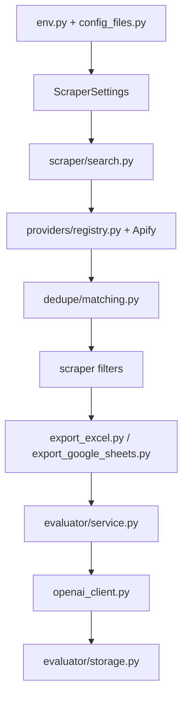

# `jobfinder` Package

This package contains the production implementation behind the root
compatibility scripts:

- `run_job_pipeline.py`
- `linkedin_job_scraper.py`
- `job_fit_evaluator.py`
- `job_scraper_config.py`

New code should import from `jobfinder.*`. The root scripts exist to preserve
older local commands and to make the package usable before an editable install.

## Package Map

| Path | Responsibility |
|---|---|
| `config_files.py` | Loads `configs/keywords.txt` and `configs/filters.json` and provides typed config helpers. |
| `env.py` | Reads real environment variables with `.env` fallback. Real env values win. |
| `paths.py` | Central repository-relative file paths. |
| `core/` | Shared runtime helpers such as CLI logging setup. |
| `google_sheets.py` | Shared Google API auth and A1 sheet-name quoting helpers. |
| `google_drive.py` | Google Drive folder and PDF upload helpers. |
| `providers/` | Stable provider adapter surface, Apify client, provider registry, actor payloads, and actor-output normalization. |
| `scraper/` | Scraper settings, search execution, dedupe handoff, filters, exports, and Google Sheets history. |
| `dedupe/` | Deterministic cross-provider duplicate detection and canonical merge logic. |
| `evaluator/` | OpenAI job-fit evaluation, CV PDF generation, parsing, storage adapters, and final cleanup. |
| `pipeline/` | One-step scrape/evaluate CLI and preflight checks. |
| `spreadsheet/` | Canonical spreadsheet column contracts shared by scraper and evaluator. |
| `operations/` | Sanitized runtime report helpers for CI artifacts. |

## Runtime Entry Points

| Console script | Module | Root wrapper |
|---|---|---|
| `jobfinder-pipeline` | `jobfinder.pipeline.cli:main` | `run_job_pipeline.py` |
| `jobfinder-scrape` | `jobfinder.scraper.cli:main` | `linkedin_job_scraper.py` |
| `jobfinder-evaluate` | `jobfinder.evaluator.cli:main` | `job_fit_evaluator.py` |

Without `python -m pip install -e .`, direct module execution requires:

```bash
env PYTHONPATH=src python -m jobfinder.pipeline.cli --help
```

The root wrappers add `src` to `sys.path` themselves, so they work from a fresh
clone as long as dependencies are installed.

## Architecture Boundaries

The package is intentionally split into services and pure helpers:

- CLI modules parse user input, configure logging, convert exceptions into
  process exit codes, and write optional JSON reports.
- Service modules orchestrate workflow steps and are easier to test directly.
- Provider modules translate between JobFinder settings and external actor
  schemas. `providers/registry.py` is the adapter table used by scraper
  orchestration.
- Storage modules isolate Excel and Google Sheets APIs.
- `spreadsheet/schema.py` is the shared contract. Scraper and evaluator should
  not invent independent column lists.

## Data Flow



## Design Constraints

- Keep secrets out of repository files. Private runtime files are ignored by
  `.gitignore`.
- Preserve spreadsheet column names unless downstream docs and tests are updated
  with the change.
- Prefer deterministic parsing and matching over AI for scraper and dedupe
  behavior.
- Avoid provider-specific fields leaking into spreadsheet columns. Provider
  metadata should be internal unless deliberately promoted into
  `spreadsheet/schema.py`.
- Keep service functions usable outside the CLI; tests depend on that boundary.

## Extension Points

Common changes and where they belong:

| Change | Start here |
|---|---|
| Add a provider | `providers/`, `scraper/search.py`, `scraper/settings.py`, provider tests. |
| Change output columns | `spreadsheet/schema.py`, exporters, evaluator parsing/storage, docs, tests. |
| Tune dedupe identity | `dedupe/normalize.py`, `dedupe/scoring.py`, `dedupe/matching.py`, `tests/test_dedupe_matching.py`. |
| Change evaluator output parsing | `evaluator/parsing.py`, `evaluator/models.py`, evaluator tests. |
| Change production scheduling | `.github/workflows/jobs.yml` and `.github/workflows/README.md`. |
