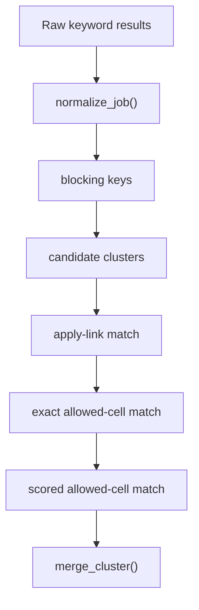

# Dedupe

The dedupe package performs deterministic duplicate detection across provider
results and keyword searches. It does not use AI.

The public entry point is:

```python
from jobfinder.dedupe import deduplicate_search_results
```

## Prerequisites

- Python 3.14 or newer.
- No external services or API keys. Dedupe is pure local logic.

## Quick Start

```bash
python -m pytest tests/test_dedupe_matching.py tests/test_scraper_normalize.py
```

Minimal usage:

```python
from jobfinder.dedupe import deduplicate_search_results

result = deduplicate_search_results(
    [
        ("GIS analyst", [{"title": "GIS Analyst", "companyName": "Acme"}]),
        ("geospatial", [{"title": "GIS Analyst", "companyName": "Acme"}]),
    ]
)
print(result.output_count)
```

## Why This Exists

The same real-world job can appear:

- Under several keywords from the same provider.
- On multiple providers with different board-specific IDs.
- With slightly different title, company, location, or job-type text.

The dedupe pipeline collapses those rows into one canonical job while preserving
source provenance and matched keywords.

## Modules

| Module | Responsibility |
|---|---|
| `models.py` | Dataclasses for normalized jobs, provenance, salary ranges, match decisions, and results. |
| `normalize.py` | Canonicalizes fields, URLs, source labels, locations, job types, salary text, dates, and blocking keys. |
| `scoring.py` | Deterministic similarity functions and conflict checks. |
| `matching.py` | Cluster matching pipeline and decision orchestration. |
| `merge.py` | Canonical merge logic for duplicate clusters. |

## Matching Pipeline



## Identity Inputs

Matching is intentionally limited to a small, explainable identity surface:

- Company.
- Title.
- Location.
- Job type.
- Posted time.
- External company apply URL when it is not a provider-owned job-board URL.

Provider job URLs and provider IDs are retained as provenance, but they are not
used as cross-provider identity by themselves.

## Blocking And Scoring

`normalize.py` builds blocking keys such as:

- External apply URL.
- Normalized company/title/location/job-type profile.
- Company plus title signature.
- Company plus role token.

`matching.py` then evaluates candidates using:

| Stage | Purpose |
|---|---|
| `company_apply_link` | Strong match when the external company apply URL matches and identity cells do not conflict. |
| `exact_allowed_cells` | Exact normalized profile match across company, title, location, job type, and post time. |
| `allowed_cell_score` | Weighted similarity score with explicit blockers. |

Current thresholds are defined in `matching.py`:

- Company: `0.90`
- Title: `0.82`
- Location: `0.82`
- Job type: `0.70`
- Posted time: `0.55`
- Overall: `0.88`

## Merge Behavior

`merge_cluster()` chooses a base job by richness and then preserves:

- Combined `_source` and `_source_label`.
- Ordered `keywords_matched`.
- Richest description.
- Best source/apply URLs.
- `_jobfinder_provenance` with source-specific URLs, IDs, and keywords.
- Provider metadata dictionaries.
- Salary metadata when available.

## Constraints

- Salary differences do not block matching. Salary is preserved as metadata.
- Seniority conflicts and role-family conflicts block otherwise similar rows.
- Job-type conflicts can block matching.
- Very distant posted times can block matching.
- Location normalization includes common German/English aliases such as
  `Munich`/`Muenchen`/`München` and `Cologne`/`Koeln`/`Köln`.

## Testing

Run:

```bash
python -m pytest tests/test_dedupe_matching.py tests/test_scraper_normalize.py
```

Update tests whenever identity fields, thresholds, or merge precedence change.

## Use This For Your Own Project

Most forks should tune keywords and final filters before changing dedupe logic.
Change the matcher only when the same real-world job is repeatedly merged or
split incorrectly for your providers or geography.

When changing matching behavior, update:

- `normalize.py` for field cleanup and blocking keys.
- `scoring.py` for similarity and conflict checks.
- `matching.py` for thresholds and match stages.
- `merge.py` for canonical row precedence.
- `tests/test_dedupe_matching.py` for examples of the intended behavior.

## Troubleshooting

| Problem | What to check |
|---|---|
| Real duplicates are not merging | Inspect normalized company, title, location, job type, posted time, and external apply URL. |
| Different jobs are merging | Check seniority, role-family, job-type, and posted-time blockers. |
| Provider URLs look identical but rows stay separate | This is intentional; provider job URLs are provenance, not cross-provider identity. |
| A threshold change affects many rows | Run focused tests and review a scrape-only output before enabling evaluation. |
