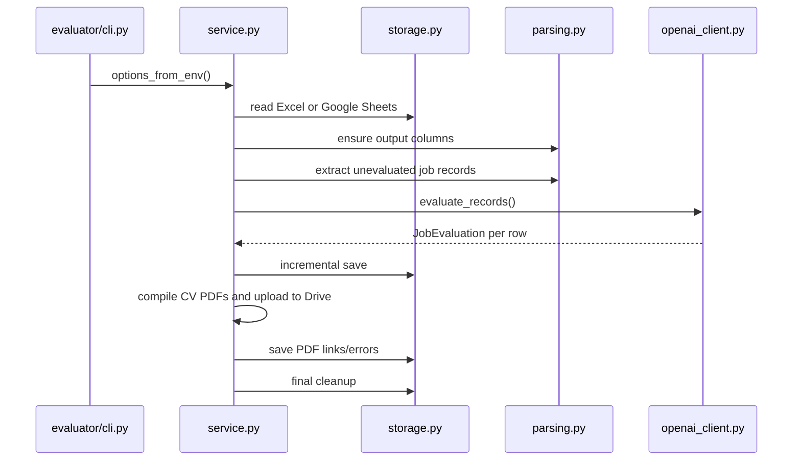

# Evaluator

The evaluator reads scraped jobs from Excel or Google Sheets, evaluates
unevaluated rows with OpenAI, writes final AI columns back to the same sheet, and
cleans the output.

The CLI entry point is:

```bash
python job_fit_evaluator.py
```

or, after editable install:

```bash
jobfinder-evaluate
```

## Modules

| Module | Responsibility |
|---|---|
| `models.py` | Evaluation dataclasses, final AI output columns, and spreadsheet-safe value handling. |
| `parsing.py` | Header normalization, job-record extraction, prompt construction, and model-response parsing. |
| `openai_client.py` | OpenAI Responses API integration, retry classification, concurrency, batching, and pacing. |
| `latex.py` | Isolated LaTeX compilation with captured compiler errors. |
| `pdf_output.py` | CV PDF ID assignment, filename sanitization, Drive folder creation, upload orchestration, and PDF sheet values. |
| `storage.py` | Excel and Google Sheets read/write adapters and final cleanup. |
| `service.py` | End-to-end evaluator orchestration outside the CLI. |
| `cli.py` | CLI argument parsing, logging, error handling, and report writing. |

## Evaluation Flow



## Input Selection

The evaluator source is resolved in this order:

1. `--source` CLI argument.
2. `JOB_EVAL_SOURCE`.
3. Google Sheets when a spreadsheet ID is configured.
4. Excel otherwise.

Google spreadsheet IDs are resolved from:

1. `--google-sheet-id`.
2. `JOB_EVAL_GOOGLE_SPREADSHEET_ID`.
3. `GOOGLE_SPREADSHEET_ID`.
4. `google_spreadsheet_id.txt`.

`--sheet latest` selects the newest worksheet/tab by workbook order.

## Prompt Construction

For each queued row:

1. Operational columns are excluded from the prompt, including application
   status, applicant counts, job/apply URLs, and existing AI output.
2. Remaining useful cells become `Header: value` lines.
3. The final prompt joins:
   - `prompts/master_prompt.txt`
   - the job advertisement text
   - `cv/master_cv.tex` inside a LaTeX code block

`openai_client.py` also supplies strict machine-readable instructions requiring
the first lines:

```text
Verdict: <Suitable | Not Suitable>
Fit Score: <integer>%
Unsuitable Reasons: <category labels only when Not Suitable, otherwise blank>
```

## Output Columns

The final evaluator columns are defined in `spreadsheet/schema.py` and imported
through `models.py`:

- `AI Verdict`
- `AI Fit Score`
- `AI Unsuitable Reasons`
- `AI Tailored CV`
- `AI CV PDF`

Legacy AI metadata columns are recognized and removed during final cleanup:

- `AI Category`
- `AI Reason`
- `AI Raw Verdict`
- `AI Evaluated At`
- `AI Model`
- `AI Error`

Detail columns such as `Job Description`, `Description`, `Details`, and
`Job Details` are also removed after evaluation.

## Incremental Saves

`run_evaluation()` saves completed evaluations through the `on_evaluation`
callback. By default, `JOB_EVAL_SAVE_BATCH_SIZE=1`, so each completed row is
written immediately. This makes long evaluation runs recoverable: a later
OpenAI, Google, or process failure does not erase completed rows.

Final cleanup runs after all queued rows finish.

## PDF Output

When `JOB_EVAL_CV_PDF_OUTPUT=true`, suitable rows with generated LaTeX CVs are
assigned run-local IDs from `1` to `n`. PDF filenames start with that ID and use
a sanitized row display name, for example `1_GIS Analyst Acme.pdf`.

Each CV is compiled in its own temporary directory with `latexmk -xelatex`.
`JOB_EVAL_CV_PHOTO_FILE` defaults to `cv/photo.jpg`; when present, it is copied
into the temp directory before compilation. Compilation errors are written to
`AI CV PDF` for that row and do not stop the evaluator.

Successful PDFs are uploaded to a new timestamped folder named
`YYYY-MM-DD_HH-MM-SS` inside a Google Drive parent folder named `JobFinder` by
default. The same Google service-account credentials are used for Drive.

## Rejection Row Policy

`JOB_EVAL_UNSUITABLE_ROW_POLICY` controls final row removal:

| Policy | Behavior |
|---|---|
| `single_label_only` | Delete `Not Suitable` rows unless they have exactly one unsuitable-reason label. |
| `keep_all` | Keep every evaluated row. |

Labels are counted by splitting on semicolons or newlines. List markers like
`1.` or `-` are ignored for counting.

## OpenAI Retry And Pacing

The evaluator retries retryable API failures such as rate limits, timeouts,
connection errors, and 5xx responses. It does not retry `insufficient_quota`.

Large queue pacing activates only when queued rows exceed
`JOB_EVAL_LARGE_QUEUE_THRESHOLD`. When enabled, request starts are spaced by
`JOB_EVAL_LARGE_QUEUE_SLEEP_MS`.

## Extension Points

| Change | Files |
|---|---|
| Change machine-readable model format | `openai_client.py`, `parsing.py`, tests. |
| Add output columns | `spreadsheet/schema.py`, `models.py`, `storage.py`, tests, docs. |
| Change PDF generation or Drive upload | `latex.py`, `pdf_output.py`, `service.py`, tests, docs. |
| Change cleanup policy | `service.py`, `storage.py`, evaluator storage tests. |
| Add a storage backend | `storage.py`, `service.py`, CLI source parsing. |

## Testing

Run:

```bash
python -m pytest tests/test_evaluator_parsing.py tests/test_evaluator_storage.py tests/test_evaluator_openai_client.py tests/test_evaluator_cli.py
```
