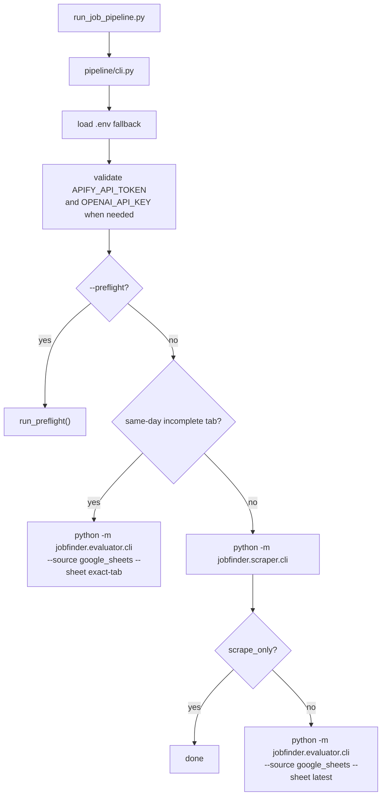

# Pipeline

The pipeline package runs JobFinder as one coordinated workflow: scrape jobs to
Google Sheets, then optionally evaluate the newly created latest tab.

The CLI entry point is:

```bash
python run_job_pipeline.py
```

or, after editable install:

```bash
jobfinder-pipeline
```

## Prerequisites

- Python 3.14 or newer.
- Dependencies installed with `python -m pip install -e .` or
  `python -m pip install -r requirements.txt`.
- `APIFY_API_TOKEN` for all pipeline modes.
- Google Sheets OAuth and spreadsheet access, because the pipeline forces
  Google Sheets output.
- `OPENAI_API_KEY`, prompt/CV files, LaTeX tooling, and Drive folder ID when
  using `scrape_and_evaluate` with PDF output.

## Quick Start

```bash
python run_job_pipeline.py --mode scrape_only --preflight
python run_job_pipeline.py --mode scrape_only
```

Full scrape plus evaluation:

```bash
python run_job_pipeline.py --mode scrape_and_evaluate
```

## Files

| File | Responsibility |
|---|---|
| `cli.py` | Pipeline mode parsing, required setting validation, same-day resume checks, child process execution, and report writing. |
| `preflight.py` | Configuration, Google Sheets, prompt/CV, and OpenAI key readiness checks. |
| `resume.py` | Detect same-day Google Sheet tabs whose scraping finished but evaluation is incomplete. |

## Modes

| Mode | Behavior |
|---|---|
| `scrape_only` | Run scraper only. The pipeline still forces Google Sheets output. |
| `scrape_and_evaluate` | Resume an incomplete same-day Google Sheet tab when present; otherwise run scraper, then run evaluator against `--source google_sheets --sheet latest`. |

Aliases such as `scrape`, `scraper_only`, `full`, and `both` are accepted and
resolved in `parse_pipeline_mode()`.

## Execution Flow



Child commands are run with:

- `cwd` set to the repository root.
- `PYTHONPATH` containing the local `src` directory.
- Local `.env` values merged into the child environment without overriding real
  environment variables.
- `JOBFINDER_SCRAPER_OUTPUT_MODE=google_sheets` and legacy
  `JOBSCRAPER_OUTPUT_MODE=google_sheets`.
- `JOBFINDER_PIPELINE_MODE` set to the resolved mode.

## Preflight

`python run_job_pipeline.py --preflight` validates:

- Scraper settings and keyword/filter files.
- Apify token presence and token-count limit before settings load.
- Google Sheets authentication and spreadsheet access.
- Prompt and CV files when evaluation is enabled.
- `OPENAI_API_KEY` when evaluation is enabled.

Preflight reads Google Sheets history but does not seed the hidden
`_jobfinder_seen_jobs` tab.

## Report Output

When these env vars are set, the pipeline writes sanitized JSON reports:

| Variable | Report |
|---|---|
| `JOBFINDER_PIPELINE_REPORT_FILE` | Preflight status. |
| `JOBFINDER_SCRAPER_REPORT_FILE` | Scraper result or failure. |
| `JOBFINDER_EVALUATOR_REPORT_FILE` | Evaluator summary or failure. |

GitHub Actions sets these to paths under `reports/` and uploads them as
artifacts.

## Resume Behavior

In `scrape_and_evaluate` mode, the pipeline checks the configured Google
spreadsheet before scraping. If it finds a timestamped run tab from the current
local day with rows still queued by the evaluator, it skips scraping and runs
the evaluator against that exact tab. This lets scheduled GitHub Actions
fallback runs finish the failed step after errors such as OpenAI quota or
billing failures instead of creating another scraped tab.

Set `JOBFINDER_PIPELINE_RESUME_INCOMPLETE=false` to force the older behavior and
always start with scraping.

## Constraints

- The pipeline is Google Sheets oriented. Use `linkedin_job_scraper.py` directly
  for local Excel-only scraping.
- Resume detection only considers timestamped run tabs from the current local
  day.
- `validate_python_dependencies()` currently only checks the OpenAI package for
  evaluation mode; runtime imports still validate other dependencies when used.

## Use This For Your Own Project

Forks should change pipeline behavior through environment variables and workflow
inputs before changing `pipeline/cli.py`:

| Need | Change |
|---|---|
| Scrape without evaluation | `--mode scrape_only` or `JOBFINDER_PIPELINE_MODE=scrape_only`. |
| Resume or force fresh same-day runs | `JOBFINDER_PIPELINE_RESUME_INCOMPLETE`. |
| Child process timeout | `JOBFINDER_PIPELINE_STEP_TIMEOUT_SECONDS`. |
| Search sources and filters | Scraper env vars and `configs/filters.json`. |
| Evaluation model, concurrency, and cleanup policy | `JOB_EVAL_*` env vars. |

Use the scraper CLI directly when a fork only needs local Excel output.

## Troubleshooting

| Problem | What to check |
|---|---|
| Pipeline writes Google Sheets even though `.env` says Excel | This is intentional; the pipeline forces Google Sheets so the evaluator can read the new tab. |
| `Missing required setting(s): OPENAI_API_KEY` | Use `--mode scrape_only` or configure the OpenAI key. |
| Same-day rerun skips scraping | An incomplete timestamped tab exists and resume is enabled. Set `JOBFINDER_PIPELINE_RESUME_INCOMPLETE=false` to force scraping. |
| Preflight fails on Drive folder | Set `JOB_EVAL_CV_DRIVE_FOLDER_ID`, or set `JOB_EVAL_CV_PDF_OUTPUT=false` if PDF output is not needed. |
