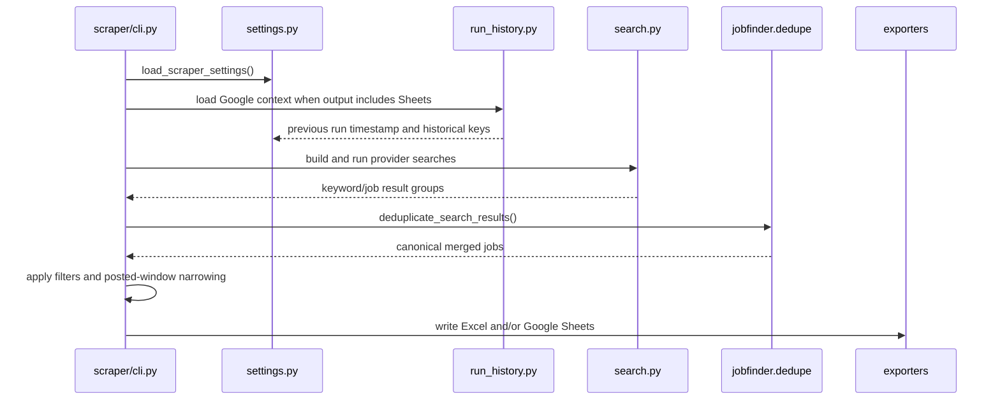

# Scraper

The scraper package collects job postings, normalizes them into JobFinder's raw
job shape, deduplicates them, applies final filters, and exports the result.

The CLI entry point is:

```bash
python linkedin_job_scraper.py
```

or, after editable install:

```bash
jobfinder-scrape
```

## Modules

| Module | Responsibility |
|---|---|
| `settings.py` | Resolve `ScraperSettings` from `.env`, real env, keywords, and filters. Defines source aliases, output modes, actor IDs, and defaults. |
| `search.py` | Build `SearchRequest` objects, batch compatible LinkedIn searches, run Apify with concurrency limits, and normalize provider failures. |
| `service.py` | Orchestrate the end-to-end scrape workflow outside the CLI. |
| `normalize.py` | Convert raw job dictionaries into stable spreadsheet values and parse applicants/dates/descriptions. |
| `filters.py` | Apply final title, company, and applicant-count filters. |
| `run_history.py` | Read Google Sheets history, derive previous-run posted windows, and maintain `_jobfinder_seen_jobs`. |
| `export_rows.py` | Build common row values for Excel and Google Sheets. |
| `export_excel.py` | Write and format local `jobs.xlsx` worksheets. |
| `export_google_sheets.py` | Create timestamped Google Sheet tabs, write values, format columns, and append seen-job keys. |
| `providers/` | Compatibility facades for historical provider import paths. New provider code lives in `../providers/`. |
| `cli.py` | CLI logging, settings validation, and report writing. |

## Execution Flow



## Output Modes

`JOBSCRAPER_OUTPUT_MODE` resolves through aliases:

| Value | Output |
|---|---|
| `excel`, `local`, `xlsx` | Local `jobs.xlsx`. |
| `google`, `google_sheets`, `sheets`, `drive` | Google Sheets tab. |
| `both`, `all` | Excel and Google Sheets. |

The pipeline CLI overrides this to `google_sheets`.

## Source Selection

`JOBSCRAPER_SOURCES` supports `linkedin`, `indeed`, `stepstone`, `both`, `all`,
and comma-separated source names.

For each selected source:

- LinkedIn creates one search URL per keyword unless batching is enabled.
- Indeed creates one actor payload per keyword.
- Stepstone creates one actor payload per keyword, unless
  `STEPSTONE_START_URLS` is set, in which case it creates one configured-URL
  search.

## Concurrency And Retries

The scraper uses:

- Global concurrency from `JOBSCRAPER_SEARCH_CONCURRENCY`.
- Source-specific caps from `INDEED_MAX_CONCURRENCY` and
  `STEPSTONE_MAX_CONCURRENCY`.
- Apify transient retry count from `APIFY_TRANSIENT_ERROR_RETRIES`.
- Backoff base delay from `APIFY_RETRY_DELAY_SECONDS`.
- Optional memory-derived concurrency cap from
  `JOBSCRAPER_APIFY_MEMORY_LIMIT_MB / APIFY_RUN_MEMORY_MB`.

Multiple Apify tokens can be configured in one `APIFY_API_TOKEN` setting with
semicolon separators. The token pool is thread-safe and retires tokens that
Apify rejects for auth, access, or billing reasons.

## Historical Windows

`JOBSCRAPER_POSTED_TIME_WINDOW=since_previous_run` depends on Google Sheets
history. The newest prior timestamped run tab becomes the exact lower bound.
The provider search window is widened by
`JOBSCRAPER_SEARCH_WINDOW_BUFFER_SECONDS`, then rows are filtered back to the
exact previous-run/current-run interval after scraping.

Rows with unparseable posted timestamps are kept.

## Export Contract

Exports use `spreadsheet/schema.py` for column names. Do not change exporter
headers independently.

Google Sheets export:

- Creates a new timestamped tab.
- Writes `HYPERLINK()` formulas for job/apply URLs.
- Freezes the header row.
- Adds a basic filter.
- Adds a dropdown to `Application Status`.
- Formats `Posted` as date/time.
- Appends canonical job keys to hidden `_jobfinder_seen_jobs`.

Excel export:

- Creates or appends to `jobs.xlsx`.
- Creates a timestamped worksheet.
- Applies header styling, row styling, widths, filters, freeze panes, and
  hyperlinks.

## Extension Points

| Change | Files |
|---|---|
| Add provider source | `settings.py`, `../providers/`, `../providers/registry.py`, tests. |
| Add final filter | `filters.py`, `service.py`, focused tests. |
| Change historical duplicate identity | `run_history.py`, dedupe tests, run-history tests. |
| Change spreadsheet columns | `../spreadsheet/schema.py`, `export_rows.py`, evaluator storage/parsing, tests, docs. |

## Important Constraints

- Keep provider actor output normalization separate from spreadsheet row
  generation.
- Do not use provider URLs alone as historical duplicate identity.
- Preserve keyword attribution when batching. LinkedIn batch fallback reruns
  searches individually if attribution is ambiguous.
- Keep source failure behavior deliberate. Stepstone failures are currently
  source-isolated; other search execution failures are fatal.
